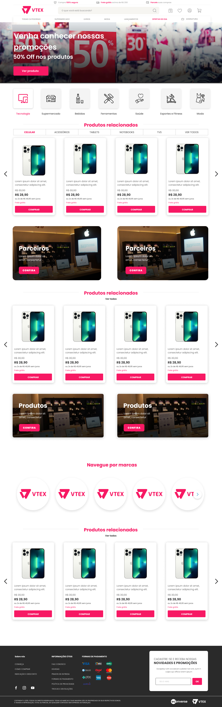

<p align="center">
  
</p>

<p align="center">
  
  
  
</p>
<br>

# Documentação

## Descrição do projeto

O projeto tem as seguintes funções:

- Ao acessar a página principal a aplicação puxa os itens da API (https://app.econverse.com.br/teste-front-end/junior/tecnologia/lista-produtos/produtos.json) e dispõe em alguns pontos pela página;
- Ao clicar no card do produto se abre um pop up com as infos do produto;

## Tecnologias

Esse projeto foi desenvolvido com as seguintes tecnologias:

- [Node.js](https://nodejs.org/en/)
- [React](https://reactjs.org)

### Pré-Processadores

- [SASS](https://sass-lang.com/)

### Automatizadores

- [Gulp](https://gulpjs.com/)

## Deploy do projeto

##### Link de acesso: https://econverse-git-master-gustavomt3-gmailcom.vercel.app/

## Como executar

#### Como rodar o projeto

```bash
# Primeiro Passo: para rodar o projeto e instalar as dependências é imprecindível ter instalado o Node.js na maquina. Em tecnologias tem o link para você fazer o download do Node.js e sua instalação;
# Segundo Passo: clone esse repositório em sua maquia;
# Terceiro passo: instale as dependências executando o comando abaixo no terminal
$ npm install
# Para iniciar o projeto execute o comando abaixo no terminal
$ npm start
# Para buildar
$ npm build
```

O app estará disponível no seu browser pelo endereço http://localhost:3000.

## Layout

<p align="center">
    
</p>
